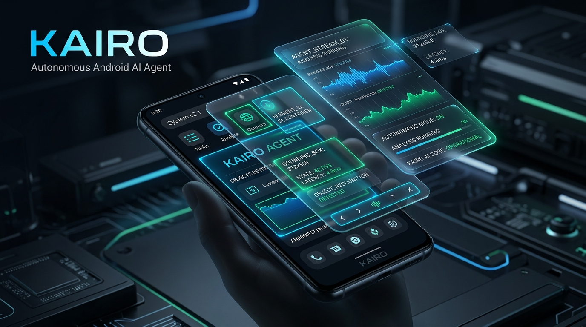
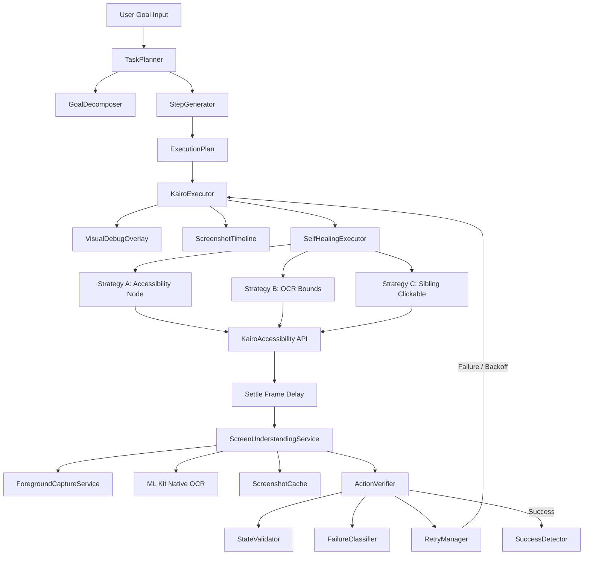

# Kairo: Autonomous Android AI Agent



### Next-generation autonomous mobile agent and secure dark-mode client implementing self-healing action trajectories, vector memories, and ML Kit vision processing natively on-device.

---

## 📖 Product Overview

Kairo is a production-grade, state-of-the-art autonomous operating agent built on top of the **GHIAS Ecosystem**. Operating directly on physical Android devices, Kairo automates complex workflows by decomposing abstract user goals into sequential UI gestures (taps, scrolls, text input) and dynamically validating the outcome of each action.

### Key Capabilities
*   🧠 **Resilient Step Planning:** Decomposes multi-app tasks using programmatic generators and target state condition matrices.
*   👁️ **On-Device Vision Pipeline:** Combines native MediaProjection screen capture with Google ML Kit text recognition for layout bounding coordinates.
*   ⚡ **Self-Healing Actions:** Recovers failed gestures by shifting targets from accessibility nodes to OCR regions or neighboring elements automatically.
*   🛠️ **Workflow Demonstration Recorder:** Learns custom automation macros by capturing native user accessibility interaction events (`TYPE_VIEW_CLICKED`).
*   💾 **Vector TF-IDF Memory:** Persists and queries previous action trajectories locally using term similarity distance metrics.
*   🔒 **Hardened Core Security:** Encrypts local session configurations via Keystore (`flutter_secure_storage`) and restricts API server listeners strictly to loopback (`127.0.0.1`).

---

## 📐 Architecture Overview

Kairo is designed under clean architecture principles, decoupling native JNI handles from Dart execution loops:



---

## 📁 Repository Directory Map

The directory structure highlights the separation of agent execution from frontend views:

```
/root/cross-platform-llm-client-main/
├── android/
│   └── app/
│       └── src/main/
│           ├── AndroidManifest.xml          # Declares permissions & services
│           ├── kotlin/com/ghias/mobile/
│           │   ├── MainActivity.kt          # MethodChannel JNI / ML Kit bindings
│           │   ├── KairoAccessibility.kt    # Native gesture injection service
│           │   └── ForegroundCapture.kt     # MediaProjection frame extractor
│           └── res/xml/
│               └── kairo_accessibility_service_config.xml # Accessibility flags
├── assets/
│   └── kairo_hero_banner.jpg                # High-fidelity project graphic
├── lib/
│   ├── main.dart                            # Global bindings & service bootstrapper
│   ├── accessibility/
│   │   └── kairo_accessibility.dart        # Dart MethodChannel access interface
│   ├── agents/
│   │   ├── kairo/
│   │   │   ├── kairo_runtime.dart           # Goal -> Plan runtime coordinator
│   │   │   ├── kairo_executor.dart          # Resilient plan step executor
│   │   │   ├── self_healing_executor.dart   # Fallback interaction sequences
│   │   │   ├── action_recorder.dart         # trajectory log persistence
│   │   │   ├── visual_debug_overlay.dart    # Floating dashboard overlays
│   │   │   └── workflow_recorder.dart       # Demonstration macro recorder
│   │   └── memory/
│   │       └── kairo_memory.dart            # Local TF-IDF cosine vector search
│   ├── device_validation/
│   │   └── validation_tests.dart            # 6 Automated device validation tests
│   ├── gateway/
│   │   └── openai_server_service_io.dart    # Hardened 127.0.0.1 HttpServer
│   ├── memory/
│   │   ├── hive_service.dart                # Local key-value database
│   │   └── secure_storage_service.dart      # Keystore encrypted configurations
│   ├── verifier/
│   │   ├── action_verifier.dart             # Step verification results compiler
│   │   ├── state_validator.dart             # Template verification checks
│   │   ├── failure_classifier.dart          # exception & crash classifiers
│   │   ├── retry_manager.dart               # Exponential backoff tracker
│   │   └── success_detector.dart            # Final goal success validator
│   └── planner/
│       ├── task_planner.dart                # Goal coordinator
│       ├── execution_plan.dart              # Model state representations
│       ├── step_generator.dart              # Concrete action converters
│       └── goal_decomposer.dart             # Goal sub-target decompilers
└── pubspec.yaml                             # Project configuration and assets
```

---

## 🛠️ Onboarding & First Device Run (HyperOS / Android 14)

Follow these steps to safely run the validation test suite on a connected physical device (e.g., Poco X6 Pro):

### 1. Pre-Launch Safety Guidelines
> [!IMPORTANT]
> To verify Kairo safely for the first time, enable **Airplane Mode** (disabling Wi-Fi and Cellular data). This guarantees Kairo runs in a 100% isolated local client container, preventing accidental network transactions.

### 2. Build and Deploy
1.  Connect your Android device with **USB Debugging** active.
2.  Install dependencies and compile the APK:
    ```bash
    flutter pub get
    flutter run lib/device_validation/validation_tests.dart
    ```

### 3. Grant HyperOS Restricted Settings (Android 13+ Security)
1.  Go to **Settings** -> **Apps** -> **Manage Apps** -> **GHIAS Mobile**.
2.  Scroll down to the bottom and toggle **Allow restricted settings**. Authenticate via fingerprint/passcode.
3.  Go to **Settings** -> **Additional Settings** -> **Accessibility** -> **Downloaded Apps**.
4.  Select **Kairo Accessibility Service** and turn it **ON**.

### 4. Enable Screen Streaming Overlay
1.  Launch GHIAS Mobile on the device.
2.  Tap the **Kairo Monitor/Eyes** switch.
3.  On the Android system popup warning, tap **Start Now**.

### 5. Execute Automated Test Suite
With the app active, the test runner executes the following validation suites:
*   **Calculator Math Test:** Launches Calculator, types `1`, `+`, `2`, `=`, and parses result `3` from the screen.
*   **Settings Navigation Test:** Launches Android settings and clicks `Display`.
*   **Scroll Test:** Injects vertical swipe gestures and verifies layout coordinate shifts.
*   **Workflow Test:** Runs multi-step goal execution templates.

---

## 📈 Roadmap & Core Milestones

- [x] **Milestone 1:** Rebrand previous package files to `GHIAS Mobile` and configure namespace packages.
- [x] **Milestone 2:** Implement accessibility node parsing, recursive layout traversals, and coordinate center clicks.
- [x] **Milestone 3:** Establish MediaProjection frame capture pipelines and integrate native ML Kit OCR text coordinates.
- [x] **Milestone 4:** Program Kairo Planner, Verifier, failure classifiers, and exponential backoff retry managers.
- [x] **Milestone 5:** Upgraded Kairo Executor with Visual debug overlays, screenshot timelines, and TF-IDF memory.
- [ ] **Milestone 6:** Integrate cloud LLM vision models (such as GPT-4o or Gemini 1.5 Pro) to analyze screenshot timeline frames dynamically.
- [ ] **Milestone 7:** Package offline native On-Device vision models using MediaPipe to execute layout classification local-only.

---

## 🤝 Contributing

We welcome contributions to GHIAS Mobile and the Kairo Agent project! Please follow these standards:
1.  **Strict Import Rules:** Do not introduce circular relative paths. Keep layers separated (e.g. `gateway` should not call controllers).
2.  **No Placeholders:** Avoid committing stubs or placeholder functions. Ensure JNI signatures match MainActivity handlers.
3.  **Local First:** Ensure that core operations can resolve offline. Hardening defaults must not be compromised.

---

## 📄 License
This project is licensed under the Apache 2.0 License. See [LICENSE](LICENSE) for details.
